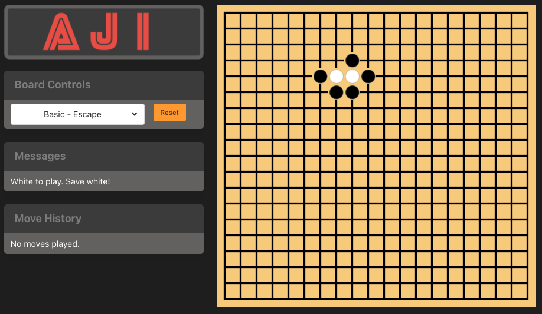

# AJI

AJI is a Go Puzzle board. Play [aji](https://aji-gg.netlify.app/)!



## Running the App

```sh
npm install
npx shadow-cljs watch app
```

When `[:app] Build completed` appears in the output, browse to [http://localhost:8280/](http://localhost:8280/).
